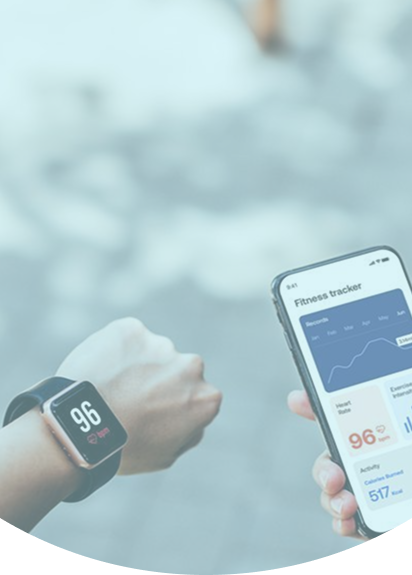
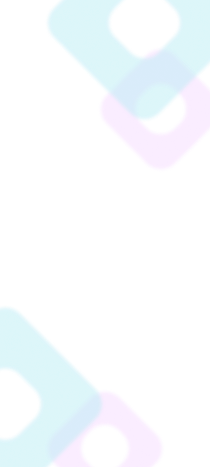
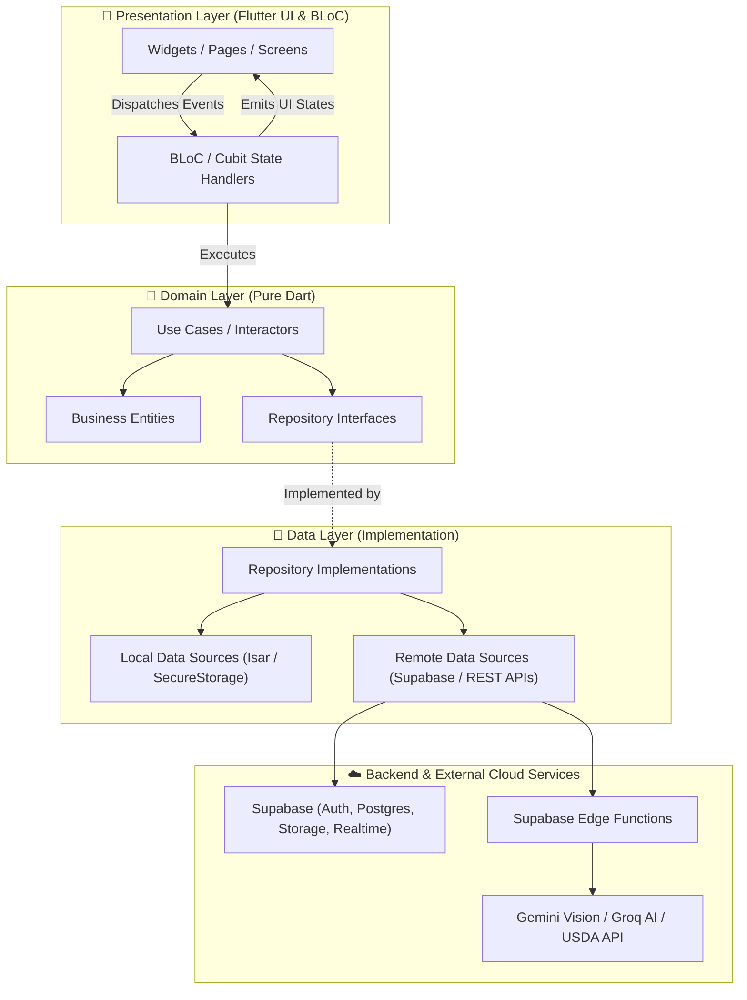
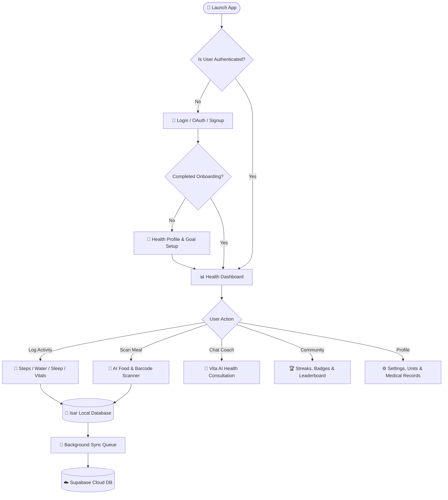
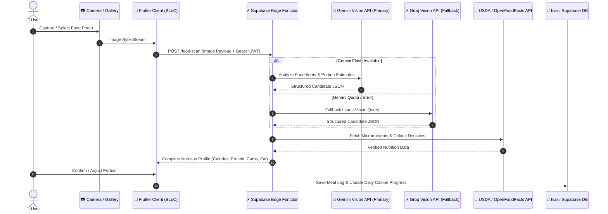
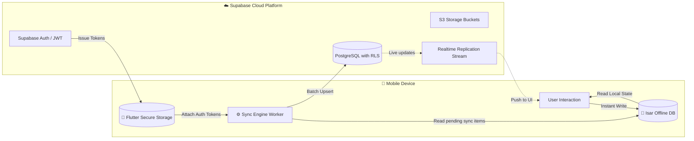

<div align="center">

# 🌟 VitalUp - Smart Health & Wellness Companion

### *Build Sustainable Habits, Track Vital Metrics & Elevate Your Wellbeing with AI Coaching*

[](https://flutter.dev)
[](https://dart.dev)
[](https://supabase.com)
[](https://bloclibrary.dev)
[](https://isar.dev)
[](https://ai.google.dev)

---

[Key Features](#-key-features) • [Screenshots](#-app-screenshots--ui-showcase) • [Architecture](#-system-architecture--flow-diagrams) • [Tech Stack](#-tech-stack) • [Getting Started](#-getting-started) • [Database & Backend](#-database--supabase-setup) • [Credits](#-credits)

---

</div>

## 📖 Overview

**VitalUp** is a next-generation holistic health, nutrition, and fitness application crafted with **Flutter** and **Clean Architecture**. It bridges real-time biometric tracking, smart hydration, sleep hygiene, and mindfulness with an **AI-powered food scanner** and **Vita (AI Health Coach)**.

Built with an **offline-first hybrid architecture**, VitalUp ensures uninterrupted habit tracking via local caching (Isar) seamlessly synchronized with **Supabase PostgreSQL**, secure storage buckets, and high-performance serverless AI endpoints.

---

## 📸 App Screenshots & UI Showcase

> *Below are visual previews of key screens and flows across VitalUp.*

| 🚀 Onboarding & Welcome | 🔐 Smart Authentication | 📊 Unified Dashboard |
|:---:|:---:|:---:|
|  |  |  |
| *Personalized goal discovery & habit setup* | *Secure OAuth, OTP & Passwordless login* | *Daily rings, steps, water & sleep metrics* |

| 🥗 AI Food Scanner | 🤖 Vita AI Health Coach | 👤 Profile & Customization |
|:---:|:---:|:---:|
|  |  |  |
| *Instant photo recognition & USDA macro analysis* | *Context-aware personalized health advice* | *Avatar uploads, metric units & medical log* |

---

## ✨ Key Features

### 🏃 1. Activity & Health Tracking
- **Smart Step & Distance Tracker:** Real-time pedometer logging, active calories burned, pace calculation, and daily step goal rings.
- **Hydration Logging:** One-tap water logging with customizable containers, progress tracking, and scheduled hydration nudge reminders.
- **Sleep Quality & Duration:** Sleep cycle logs, bed/wake time tracking, and resting trend insights.
- **Heart Rate & Vitals Monitoring:** Continuous and resting heart rate monitoring with historical statistical graphs.
- **Screen Time & Mindful Breaks:** Digital wellness tracking encouraging mindful lifestyle balance.

### 📸 2. AI-Powered Food & Nutrition Scanner
- **Dual-Model Vision Intelligence:** Primary recognition via **Google Gemini Flash Vision** with automatic, zero-downtime fallback to **Groq Vision (Llama Vision)**.
- **Deep Nutritional Breakdown:** Instant calorie, protein, carbohydrate, fat, and micronutrient computation backed by the **USDA FoodData Central** database.
- **Barcode Scanner:** Real-time packaged food scanning via **Open Food Facts**.

### 🤖 3. Vita — Personal AI Health & Wellness Coach
- **Contextual Health Guidance:** Conversational AI coach trained on lifestyle habits, dietary preferences, and logged health metrics.
- **Adaptive Action Plans:** Tailored micro-goals, workout suggestions, and weekly habit recommendations.

### 🏆 4. Gamification, Streaks & Social Community
- **Dynamic Streaks:** Streak locks and multipliers to incentivize daily consistency.
- **Challenges:** Built-in community challenges (e.g., *21-Day Hydration Hero*, *10k Step Streak*) + custom user challenges.
- **Social Connection:** Share achievements, compare daily stats on leaderboards, and celebrate milestones with friends.

### 🔒 5. Profile, Security & Health Notebook
- **Biometric & Unit Flexibility:** Support for Metric (kg, cm) and Imperial (lbs, in) conversions.
- **Avatar Management:** Profile picture upload, cropping, and instant cloud sync via Supabase Storage.
- **Digital Health Notebook:** Secure encrypted storage for medical records, lab reports, and doctor prescriptions.

---

## 🏗️ System Architecture & Flow Diagrams

VitalUp adheres strictly to **Clean Architecture** principles separated into **Domain**, **Data**, and **Presentation** layers with the **BLoC/Cubit** state management pattern.

### 1. High-Level Architectural Layers



---

### 2. User Journey & Core Application Loop



---

### 3. AI Food Scanner & Nutrition Pipeline



---

### 4. Hybrid Offline-First Sync Architecture



---

## 🛠️ Tech Stack

### **Frontend & Mobile**
- **Framework:** [Flutter](https://flutter.dev) (v3.x / Dart 3.x)
- **Architecture:** Clean Architecture (Domain, Data, Presentation)
- **State Management:** `flutter_bloc` / `bloc` / `cubit`
- **Dependency Injection:** `get_it` + `injectable`
- **Routing:** `go_router`
- **Networking:** `dio` with automatic interceptors, retry policies, and JWT auto-refresh

### **Data & Storage**
- **Local Database (Offline-First):** `isar` / `isar_flutter_libs`
- **Secure Key-Value Storage:** `flutter_secure_storage`
- **Cloud Database:** [Supabase](https://supabase.com) (PostgreSQL 15+ with Row Level Security)
- **Cloud Storage:** Supabase Storage (Buckets: `profile-pictures`, `medical-reports`, `food-images`)

### **AI & Vision Microservices**
- **Primary Vision LLM:** Google Gemini 2.5/3.0 Flash Vision API
- **Fallback Vision LLM:** Groq Llama-4 Vision API (Zero-downtime failover)
- **Nutrition Knowledge Base:** USDA FoodData Central & Open Food Facts API
- **Serverless Compute:** Supabase Edge Functions (Deno Runtime)

---

## 📂 Project Structure

```
vital_up/
├── assets/
│   ├── fonts/              # Custom brand typography
│   ├── icons/              # Scalable vector graphics (SVG)
│   ├── images/             # Onboarding illustrations & banners
│   └── data/               # Static food & challenge datasets
├── lib/
│   ├── core/
│   │   ├── config/         # App configs, Supabase credentials & API endpoints
│   │   ├── database/       # Isar database schemas & sync managers
│   │   ├── di/             # GetIt service locator registrations
│   │   ├── error/          # Failures, exceptions & error handling
│   │   ├── network/        # Dio client, interceptors & auth refreshers
│   │   ├── router/         # GoRouter navigation paths & route guards
│   │   ├── theme/          # AppTheme, typography, colors & dimension tokens
│   │   └── widgets/        # Shared buttons, inputs, cards & dialogs
│   ├── features/
│   │   ├── activity_tracking/ # Steps, heart rate, sleep & walking logic
│   │   ├── auth/           # OAuth, login, signup, OTP & session recovery
│   │   ├── community/      # Social feeds, leaderboards & friend connections
│   │   ├── dashboard/      # Daily vitals hub, progress rings & summaries
│   │   ├── food_scanner/   # AI camera scanner, barcode scanner & nutrition
│   │   ├── gamification/   # Streaks, challenge templates & achievements
│   │   ├── notifications/  # FCM push alerts, local hydration & step reminders
│   │   ├── onboarding/     # Goal selection, personal biometric input & permissions
│   │   ├── profile/        # Avatar management, unit settings & medical records
│   │   ├── reminders/      # Scheduled habit nudges
│   │   └── vita/           # Vita AI Health Coach conversation interface
│   └── main.dart           # Application entry point & service initialization
├── supabase/
│   ├── functions/          # Deno-based Edge Functions (food-scan proxy, vita AI)
│   └── migrations/         # PostgreSQL DDL, tables, triggers & RLS policies
└── pubspec.yaml            # Dependencies, assets & fonts configuration
```

---

## 🚀 Getting Started

### Prerequisites
- [Flutter SDK](https://docs.flutter.dev/get-started/install) (`>= 3.2.0`)
- [Dart SDK](https://dart.dev/get-dart) (`>= 3.2.0`)
- Android Studio / VS Code with Flutter & Dart extensions
- A [Supabase](https://supabase.com) project account

---

### Installation Steps

1. **Clone the Repository:**
   ```bash
   git clone https://github.com/TarunTalan/vital_up.git
   cd vital_up
   ```

2. **Install Dependencies:**
   ```bash
   flutter pub get
   ```

3. **Generate Code (Isar schemas & injectable):**
   ```bash
   dart run build_runner build --delete-conflicting-outputs
   ```

4. **Configure Environment Variables:**
   Create or update your Supabase configuration in `lib/core/config/supabase_config.dart` or `.env`:
   ```dart
   class SupabaseConfig {
     static const String supabaseUrl = 'https://YOUR_PROJECT_ID.supabase.co';
     static const String supabaseAnonKey = 'YOUR_ANON_PUBLIC_KEY';
   }
   ```

5. **Run on Emulator or Physical Device:**
   ```bash
   # Run in Debug mode
   flutter run

   # Or run specific target
   flutter run -d android
   ```

---

## 🗄️ Database & Supabase Setup

VitalUp utilizes PostgreSQL with **Row Level Security (RLS)** to safeguard patient and personal health data.

### Storage Buckets Setup
Ensure the following Supabase storage buckets exist with proper policies:
- `profile-pictures` *(Public read, authenticated write)*
- `food-images` *(Authenticated upload & read)*
- `medical-reports` *(Private, signed URL access only)*

### Database Tables Overview
- `profiles` — User demographics, metric units, avatar URLs, and health preferences.
- `step_logs` — Timestamped step increments, active minutes, and estimated distance.
- `water_logs` — Daily hydration entries and goal milestones.
- `sleep_logs` — Sleep duration, deep/light cycles, and wake times.
- `food_logs` — Logged meals, macro breakdowns, and scanned food images.
- `streaks` — Active streaks, highest streaks, and streak freeze protections.
- `challenges` — Community challenge participation and progress.

---

## 👥 Credits

- **UI/UX Design:** Vedanshi
- **Development:** Tarun & Siddhi


---

## 📄 License

This project is licensed under the **MIT License** — see the [LICENSE](LICENSE) file for details.

<div align="center">
  <sub>Built with ❤️ by the VitalUp Team</sub>
</div>